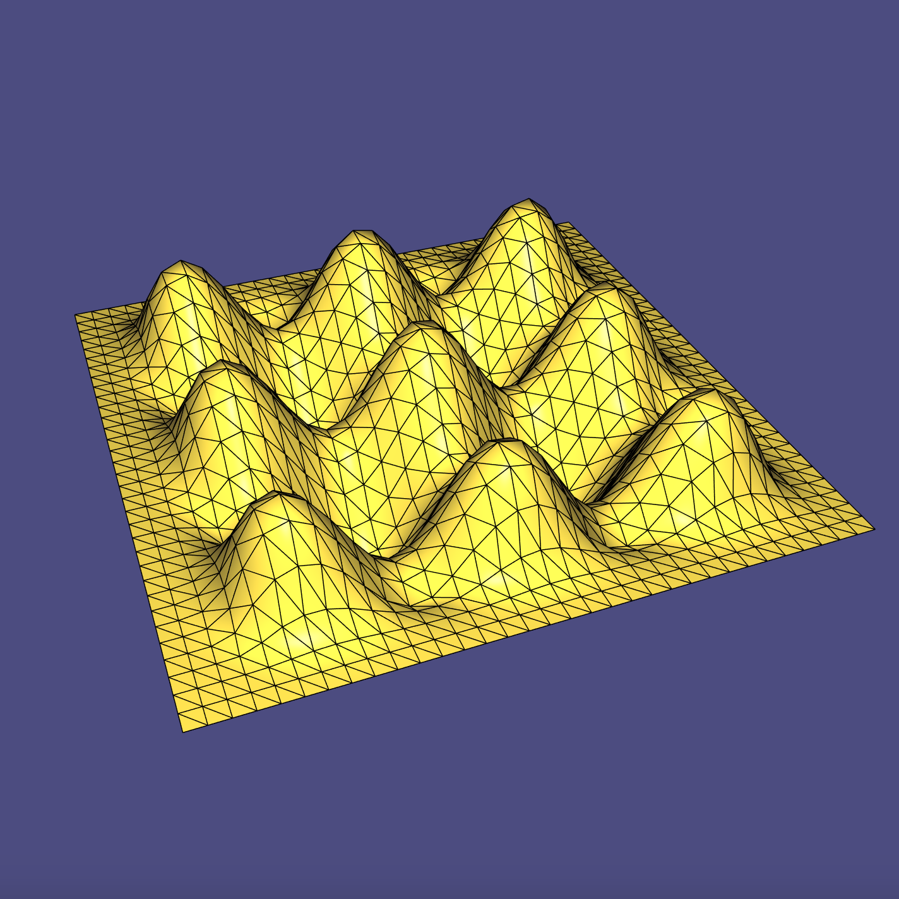
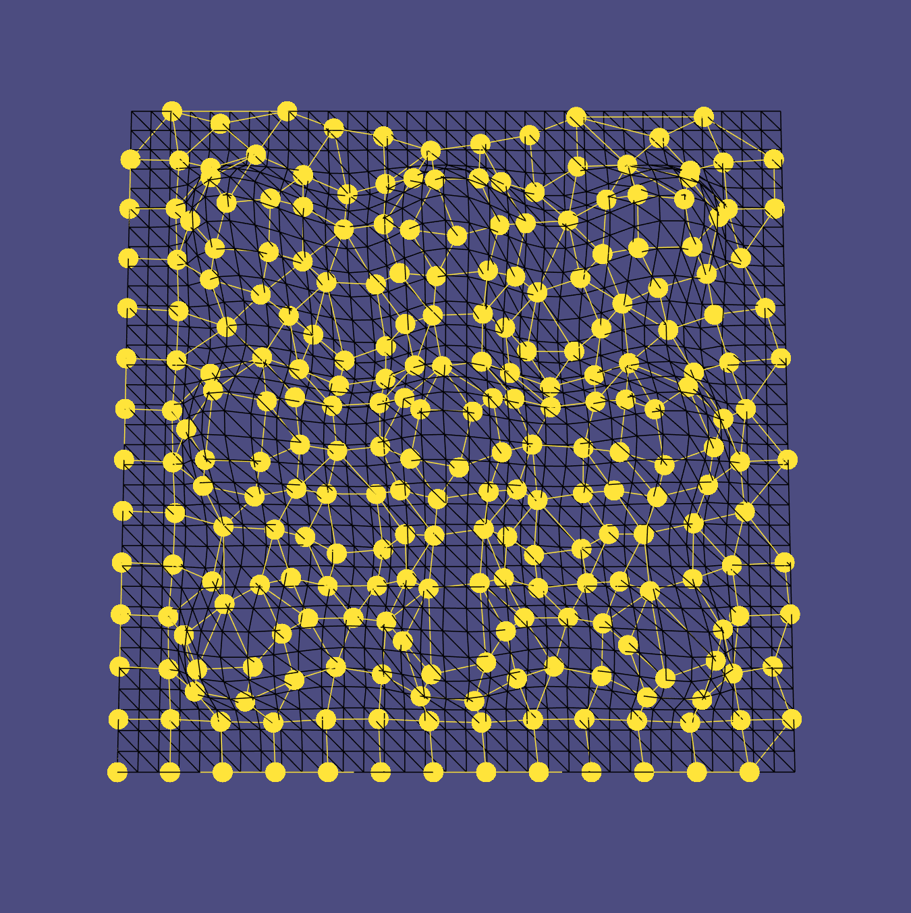
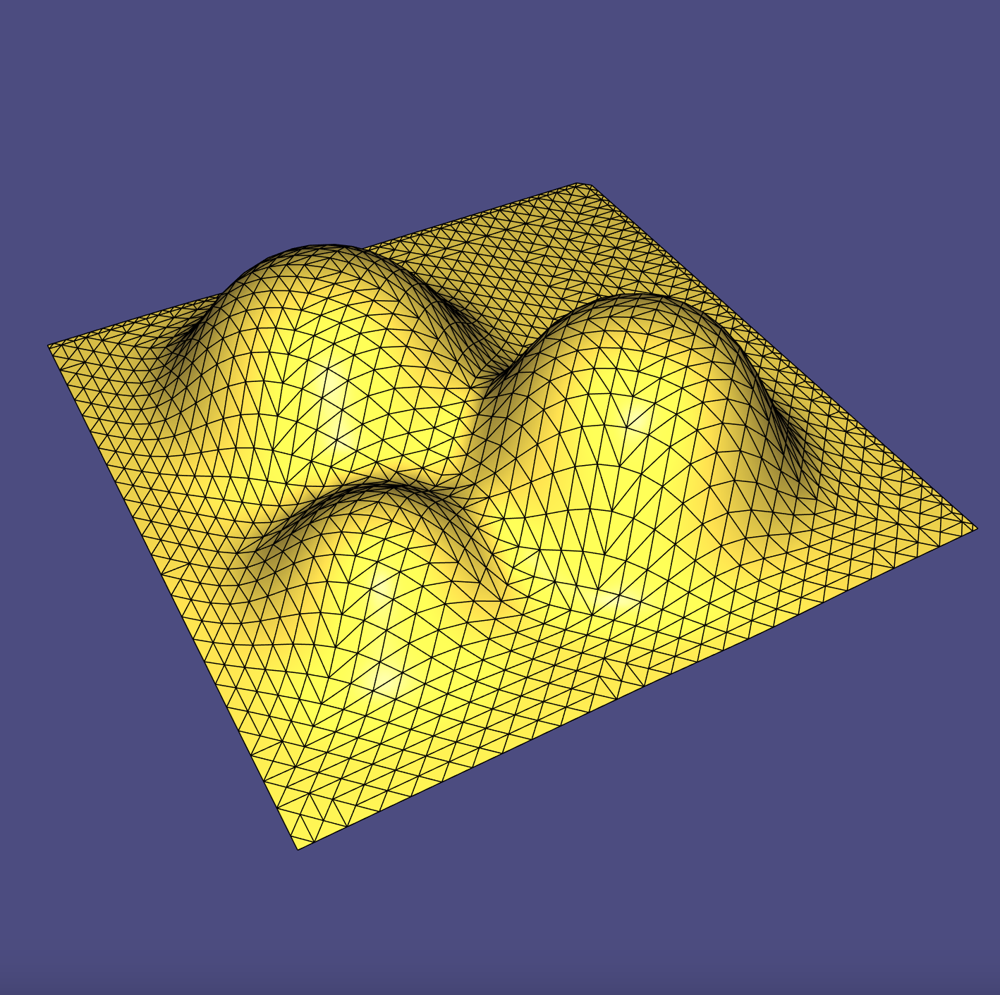
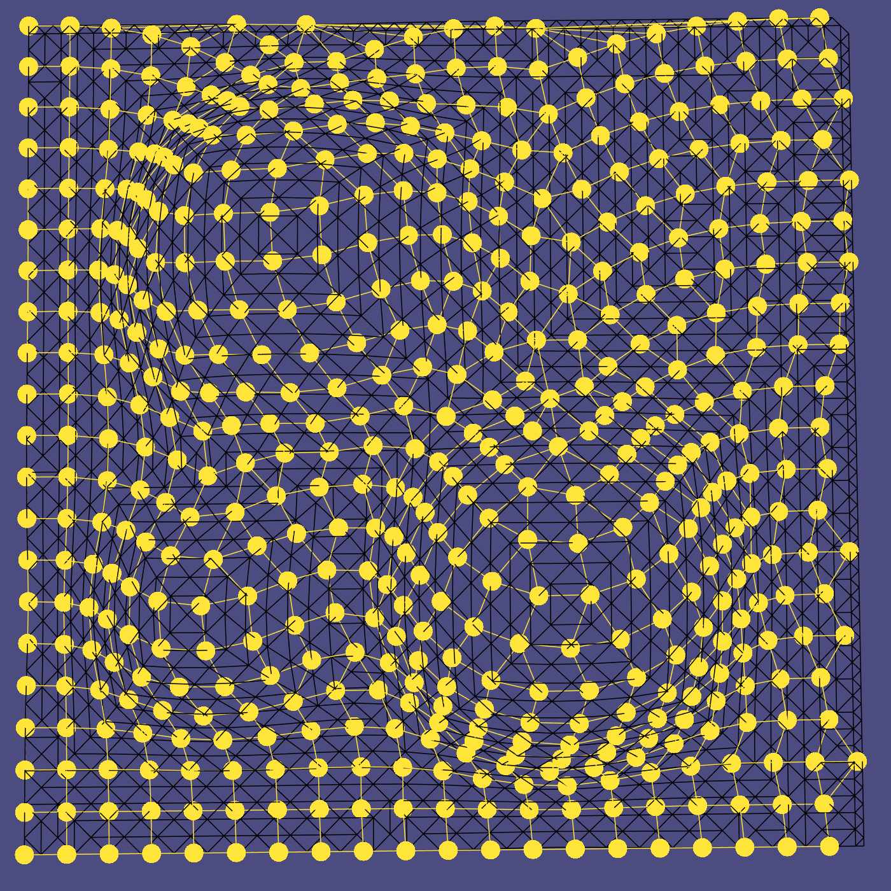

# Computational Design of Stable Crochet

A C++ / libigl implementation of two methods tackling the inverse design problem for crochet. Implemented as part of a semester thesis project on the computational design of stable crochet, as detailed in the [project report]([report/report.pdf](https://github.com/trastopchin/stable-crochet/blob/main/report/report.pdf)).

For an input topological disk represented by a triangle mesh, I implemented visualizations for:
1. An ARAP-based crochet pattern generation algorithm, and 
2. A simplified version of Igarashi et al.'s algorithm.

## Screenshots

    
    

 

On the left, a render of bump_plane_low.obj, and on the right, its corresponding stitch graph produced with the simplified version of Igarashi et al.'s algorithm.

    
    

 

On the left, a render of three_bumps.obj, and on the right, its corresponding stitch graph produced with the simplified version of Igarashi et al.'s algorithm.

## Compile

Compile this project using the standard cmake routine:

    mkdir build
    cd build
    cmake ..
    make

This should find and build the dependencies and create a `example` binary.

## Run

From within the `build` directory just issue:

    ./stable_crochet input.obj

## License

The C++ code is licensed under the Mozilla Public License, version 2.0.
